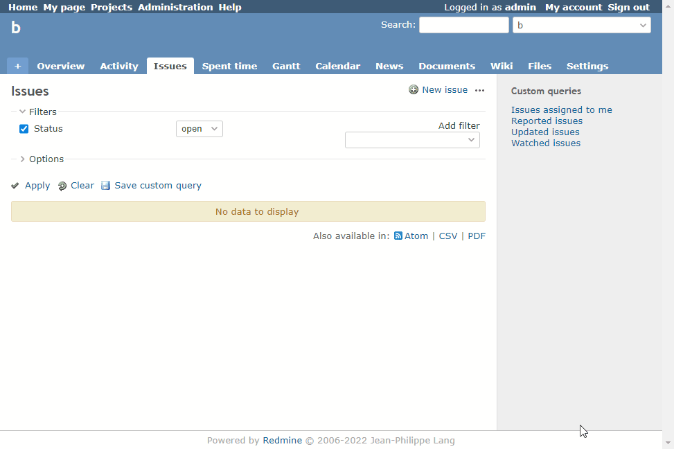

# Set author as default value for custom field

Set author as default value for custom field.  
カスタムフィールドのデフォルト値として作成者を設定します。

## Setting

### Path Pattern

`/issues/new$`

### Insert Position

Head of all pages
<!-- 
Head of all pages
Bottom of issue form
Bottom of issue detail
Bottom of all pages
-->

### Code

JavaScript
<!--
JavaScript
CSS
HTML
-->

```javascript
$(function() {

  // Note: Change the ID according to the custom field you want to target
  $('#issue_custom_field_values_1').val(ViewCustomize.context.user.id);
})
```

## Result


