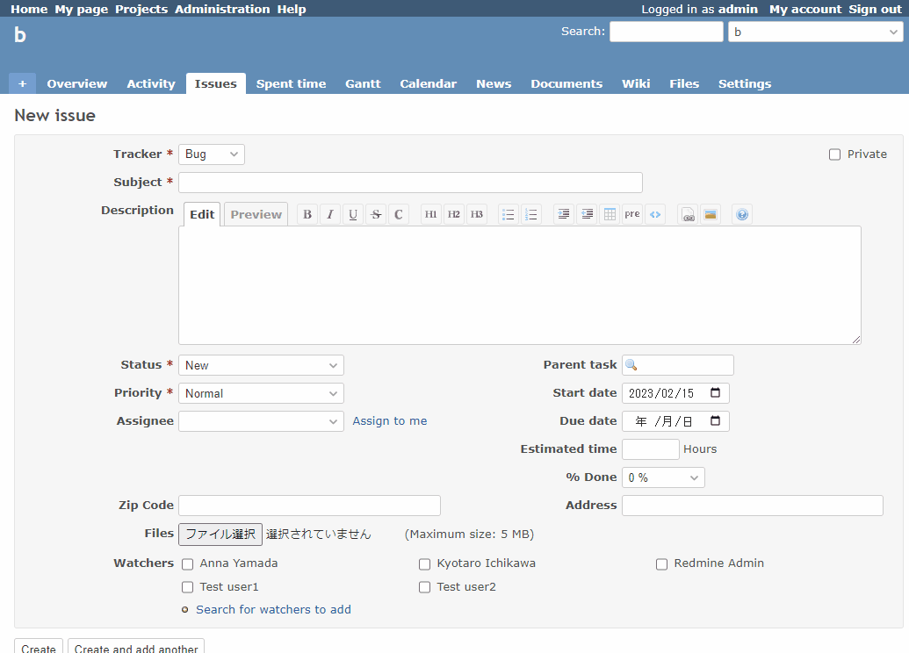

# Get address from postal code using Web API and set

Get address from postal code using Web API and set.  
Web APIを利用して郵便番号から住所を取得して設定します。

The following API is used. (Address in Japan)  
下記のAPIを利用します。

* http://zipcloud.ibsnet.co.jp/doc/api

## Setting

### Path Pattern

None

### Insert Position

Bottom of issue form
<!-- 
Head of all pages
Bottom of issue form
Bottom of issue detail
Bottom of all pages
-->

### Code

JavaScript
<!--
JavaScript
CSS
HTML
-->

```javascript
$(function() {

  // Note: Change the ID according to the custom field you want to target
  const zipcodeField = $('#issue_custom_field_values_1');
  const addressField = $('#issue_custom_field_values_2');

  zipcodeField.on('change', async () => {
    if (addressField.val() == '') {
      const res = await (await fetch('https://zipcloud.ibsnet.co.jp/api/search?zipcode=' + zipcodeField.val())).json();
      if (res.status == '200') {
        const result = res.results[0];
        addressField.val(result.address1 + result.address2 + result.address3);
      }
    }
  });
})
```

## Result


