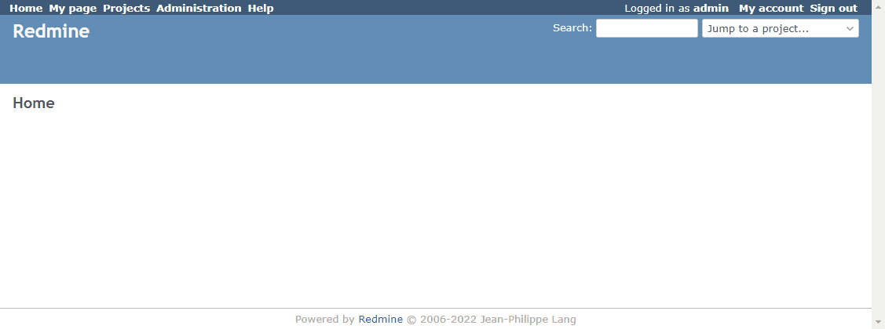

# Change the link in Projects to My projects

Change the link in Projects to My projects.  
プロジェクトのリンクをMy projectsに変更します。

## Setting

### Path Pattern

None

### Insert Position

Head of all pages
<!-- 
Head of all pages
Bottom of issue form
Bottom of issue detail
Bottom of all pages
-->

### Code

JavaScript
<!--
JavaScript
CSS
HTML
-->

```javascript
$(function() {
  const projectsLink = $('#top-menu a.projects, #main-menu a.projects');
  projectsLink.attr('href', projectsLink.attr('href') + '?query_id=5');
})
```

## Result


