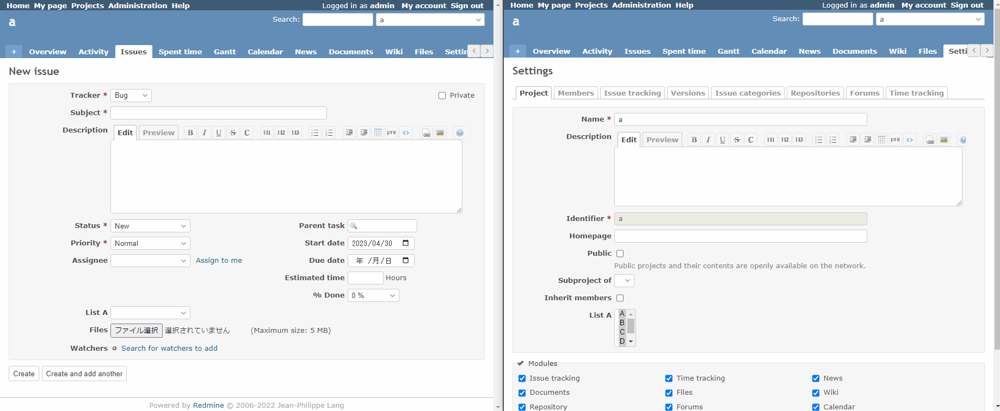

# Control custom field choices in issue with custom field in project

Control custom field choices in issue with custom field in project.  
チケットのカスタムフィールドの選択肢を、プロジェクトのカスタムフィールドで制御します。

## Setting

### Path Pattern

None

### Insert Position

Bottom of issue form
<!-- 
Head of all pages
Bottom of issue form
Bottom of issue detail
Bottom of all pages
-->

### Code

JavaScript
<!--
JavaScript
CSS
HTML
-->

```javascript
$(function() {
  // Note: Change the ID according to the custom field you want to target.
  const issueCoustomFiledId = 10;
  const projectCoustomFiledId = 11;
  const projectCoustomFiled = ViewCustomize.context.project.customFields.find(x => x.id == projectCoustomFiledId);


  const isTarget = (option) => {
    let projectValue;
    // Note: Issue and Project custom fields have different values and need to be mapped.
    switch(option.val()) {
      case '8':
        projectValue = '13';
        break;
      case '9':
        projectValue = '14';
        break;
      case '10':
        projectValue = '15';
        break;
      case '11':
        projectValue = '16';
        break;
      case '12':
        projectValue = '17';
        break;
    }

    return projectCoustomFiled.value.includes(projectValue);
  }

  $('#issue_custom_field_values_' + issueCoustomFiledId + ' > option').each(function() {

    const option = $(this);

    // Narrow down by match.
    // (In IE, option is not hidden by "display:none", so "disabled" it to make it unselectable.)
    if (isTarget(option)) {
      option.show();
      option.prop('disabled', false);
    } else {
      option.hide();
      option.prop('disabled', true);
    }
  });

})
```

## Result


