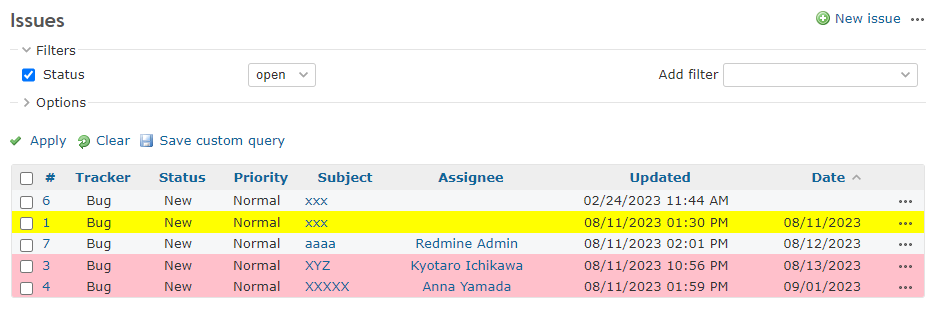

# Change the background color of the issue list according to the date of the custom field

Change the background color of the issue list according to the date of the custom field.  
カスタムフィールドの日付に応じて、チケットリストの背景色を変更します。

This example changes the background color depending on the date of the custom field ID:1.  
この例では、カスタムフィールドID:1の日付によって背景色を変えています。

* Pink for future  
未来はピンク
* Yellow for past  
黄色は過去

## Setting

### Path Pattern

`/issues$`

### Insert Position

Head of all pages
<!-- 
Head of all pages
Bottom of issue form
Bottom of issue detail
Bottom of all pages
-->

### Code

JavaScript
<!--
JavaScript
CSS
HTML
-->

```javascript
$(function() {

  const now = new Date();
  const nowDate = new Date(now.getFullYear(), now.getMonth(), now.getDate());

  $('table.issues td.cf_1').each(function() {
    const target = $(this);
    const str = target.text();
    if (str === '') {
      return;
    }

    const date = new Date(str);
    if (date > nowDate) {
      target.parent().css({ 'background-color': 'pink' });
    } else if (date < nowDate) {
      target.parent().css({ 'background-color': 'yellow' });
    }
  });
});
```

## Result


