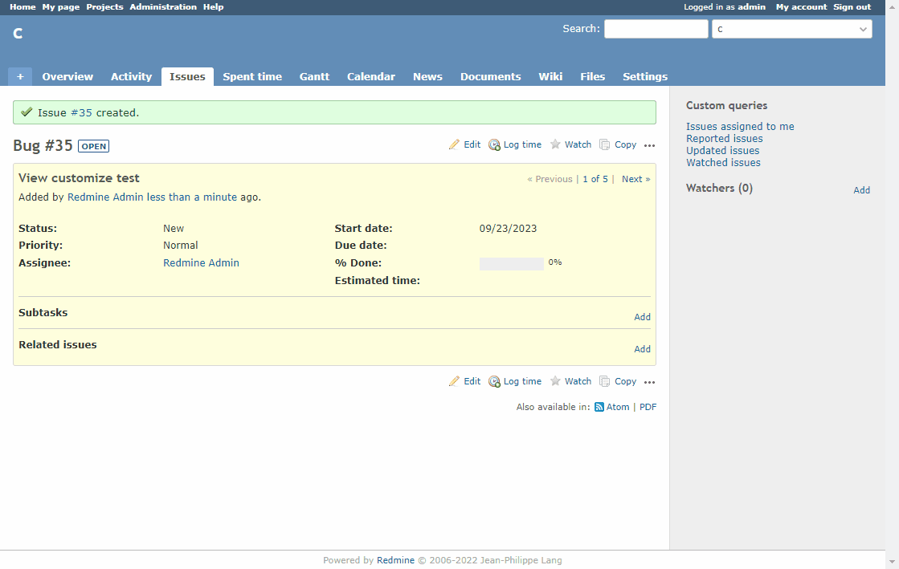

# Require attachments when changing status to closed

Require attachments when changing status to closed.  
ステータスを終了に変える時に、添付ファイルを必須にします。

## Setting

### Path Pattern

None

### Insert Position

Bottom of issue detail
<!-- 
Head of all pages
Bottom of issue form
Bottom of issue detail
Bottom of all pages
-->

### Code

JavaScript
<!--
JavaScript
CSS
HTML
-->

```javascript
$(function() {
  const beforeStatusId = $('#issue_status_id').val();

  $(document).on('submit', '#issue-form', function() {
    const afterStatusId = $('#issue_status_id').val();

    if (afterStatusId != beforeStatusId && afterStatusId == '5') { // 5: Closed
      if ($('#new-attachments .attachments_fields input.filename').length == 0) { // Check zero attachments

        // If you don't reset it, it won't be submitted the next time.
        this.dataset.submitted = '';

        alert('If status is changed to Closed, attachments are required.');

        // If it returns false, it will not be executed.
        return false;
      }
    }
  });
});
```

## Result


