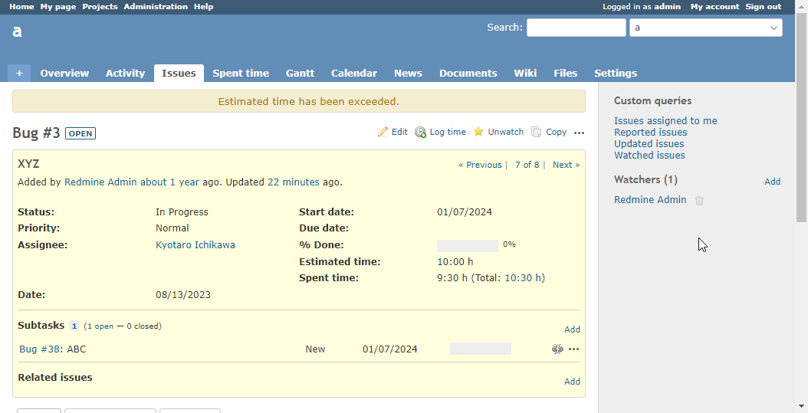

# Display a warning when spent time exceeds estimated time

The issue details screen will display a warning when spent time exceeds estimated time.  
作業時間が予定工数を超えたら警告を表示します。

## Setting

### Path Pattern

None

### Insert Position

Bottom of issue detail
<!-- 
Head of all pages
Bottom of issue form
Bottom of issue detail
Bottom of all pages
-->

### Code

JavaScript
<!--
JavaScript
CSS
HTML
-->

```javascript
$(function() {

  if (!ViewCustomize.context.issue.totalEstimatedHours) {
    return;
  }

  if (ViewCustomize.context.issue.totalSpentHours > ViewCustomize.context.issue.totalEstimatedHours) {
    $('#content').prepend('<div class="warning">Estimated time has been exceeded.</div>');
  }
});
```

## Result



## Note

`ViewCustomize.context.issue.totalEstimatedHours` and `ViewCustomize.context.issue.totalSpentHours` were added at v3.5.0.  
`ViewCustomize.context.issue.totalEstimatedHours` と `ViewCustomize.context.issue.totalSpentHours` は、 v3.5.0 にて追加されました。
